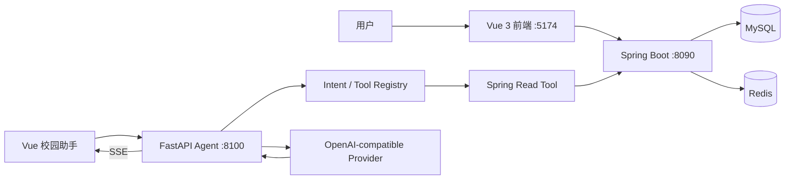

# 青禾校园生活服务系统

## 1. 项目简介

青禾校园生活服务系统是面向校园及周边生活场景的 Java 全栈工程，采用 Vue 3 与 Spring Boot 前后端分离架构。系统覆盖商铺与商品浏览、优惠券、购物车、订单、收货地址、校园探店、学生资料与宿舍管理等业务，并提供独立的 FastAPI 校园智能助手。助手通过受控 Tool Calling 调用 Spring Boot 已审核的只读接口，完成校园优惠、商铺商品、探店和登录后个人信息查询；Java 服务仍是业务规则、权限校验、MySQL 与 Redis 数据访问的唯一事实来源。前端同时提供用户端和管理端页面，后端保留 Token 鉴权、缓存与订单等业务能力。

项目定位：**传统校园生活服务平台 + 自然语言智能查询入口**。

## 2. 项目亮点

- Vue 3 + Vite 与 Spring Boot 2.7 的前后端分离实现，用户端和管理端共用一个前端工程。
- Redis Token 登录、刷新与拦截器鉴权；前端 Axios 统一透传 `Authorization: Bearer <token>`。
- 商铺和商品目录缓存包含空值缓存、随机 TTL、互斥锁与缓存击穿保护。
- 覆盖商铺、商品、购物车、模拟支付订单、优惠券、地址、探店互动、学生资料和宿舍等校园业务。
- FastAPI Agent 独立运行，支持 Mock、deterministic 与 OpenAI-compatible Provider 配置。
- Tool Registry 与 Endpoint Registry 双重白名单；Spring Tool 仅登记固定的 GET 接口。
- 浏览器 Bearer Token 可经 Agent 请求上下文转发给 Java，由 Java 最终完成用户身份与权限校验。
- 校园助手支持 SSE、多轮内存会话、Token Budget、Tool Result 精简与 Provider 适配。
- 仓库包含 Java 测试、Agent unit/contract/integration/offline E2E、真实后端测试入口、eval 与 benchmark 工具。

## 3. 系统架构



- 前端开发服务器端口为 `5174`，Spring Boot 端口为 `8090`，Agent 默认端口为 `8100`。
- Agent 不直接访问 MySQL 或 Redis；它只通过固定的 Spring GET Tool 获取业务数据。
- 普通页面与 Agent 查询复用同一 Spring Boot 业务事实源。

## 4. 功能模块

### 用户端

- 注册、验证码/密码登录、首次资料完善、个人资料和头像。
- 首页、商铺列表与详情、店内商品、评论。
- 可领取优惠券、我的优惠券、购物车、结算、订单创建、模拟支付与订单查询。
- 收货地址管理。
- 校园探店内容、评论、点赞、关注与关注流。
- 学生资料、宿舍二维码解析、扫码入住和我的宿舍。
- 校园智能助手页面与悬浮助手入口。

### 管理端

- 管理员登录、数据看板和营业报表。
- 分类、商铺、商品、店内商品分类、订单、优惠券管理。
- 探店内容管理、用户查询。
- 宿舍基础资源、学生学籍与入住管理。

### 智能助手

当前 Agent 支持校园优惠、商铺和商品、附近商铺与探店内容查询；在登录后还可查询个人资料、学生资料、宿舍、优惠券、订单和地址。安全的普通问题可走 Provider 对话，信息不足时会进行澄清，并保存有限的最近对话上下文以理解部分追问。前端通过 SSE 接收回答增量。

边界如下：

- 只开放已审核的只读 Tool，不支持支付、删除、下单等写操作。
- 不生成或执行 SQL，不直接访问 MySQL。
- 身份、权限和实时业务状态始终由 Java 服务判定。

## 5. 技术栈

### Java 后端

| 组件 | 当前源码配置 |
| --- | --- |
| Java | 8 |
| Spring Boot | 2.7.18 |
| MyBatis-Plus | 3.5.5 |
| MySQL | MySQL Connector/J（运行时依赖） |
| Redis | Spring Data Redis、Redisson 3.27.2 |
| 构建工具 | Maven |

### Vue 前端

| 组件 | 当前 package.json |
| --- | --- |
| Vue | 3.5.3 |
| Vite | 5.4.8 |
| Element Plus | 2.8.1 |
| Pinia | 2.2.2 |
| Axios | 1.7.7 |

### Agent 服务

| 组件 | 当前 pyproject.toml / 源码 |
| --- | --- |
| Python | >=3.11, <3.14 |
| Web 框架 | FastAPI |
| 数据模型 | Pydantic、pydantic-settings |
| HTTP 客户端 | HTTPX |
| Provider | OpenAI-compatible Provider、Mock、deterministic Provider |
| 编排能力 | 受控 Tool Calling、Token Budget、多轮内存会话、SSE |
| 测试 | Pytest、pytest-asyncio |

## 6. 项目目录

```text
qinghe-life-service/
├── backend/        # Spring Boot 业务服务、Mapper、SQL 与 Java 测试
├── frontend/       # Vue 3 用户端、管理端和校园助手界面
├── agent-service/  # FastAPI Agent、Provider、受控 Tool 与测试/eval
├── deploy/         # 本地部署说明与启动脚本
├── docs/           # 接口、数据库、设计与测试相关文档
└── README.md       # 项目入口说明
```

## 7. 核心业务请求链

### 普通页面请求

```text
Vue → Axios → Spring Controller → Service → Mapper → MySQL / Redis
```

### Agent 公共查询

```text
Vue Assistant → FastAPI → Intent → Tool Registry → Spring Tool → Java GET
→ ToolResult → 大模型回答 → SSE
```

### Agent 个人查询

```text
浏览器 Bearer Token → FastAPI RequestContext → Spring Tool
→ Java RefreshTokenInterceptor → LoginInterceptor → UserContext → Service
```

Agent 只从请求 Header 提取 Bearer Token，不解析或信任客户端在消息、metadata 或 Tool 参数中提供的 `userId`。

## 8. 本地运行

以下命令均为 Windows PowerShell 示例。初始化 SQL 位于 `backend/src/main/resources/sql/qinghe_life.sql`，仅供人工确认后导入，项目不会自动导入 SQL。

1. 准备 MySQL 与 Redis，并按照 `backend/src/main/resources/application.yml` 配置本地连接环境；不要将密码写入源码或 README。

2. 启动 Java 后端：

```powershell
Set-Location .\backend
mvn spring-boot:run
```

3. 准备并启动 Agent。先复制示例为本地 `.env`，再按实际需要选择 Mock、deterministic 或 Spring Tool 模式；真实 Provider 模式需要自行在本地填入 Key。

```powershell
Set-Location ..\agent-service
Copy-Item .env.local.example .env
py -3.11 -m venv .venv-clean
.\.venv-clean\Scripts\python.exe -m pip install -e ".[dev]"
.\scripts\start_agent.ps1
```

4. 启动前端：

```powershell
Set-Location ..\frontend
npm install
npm run dev
```

访问 `http://127.0.0.1:5174`。Vite 将 `/api` 与 `/ws` 代理到本地 Java `8090`。

## 9. 环境变量

Agent 的配置由 `agent-service/app/core/config.py` 和示例文件定义。复制 `agent-service/.env.local.example` 为 `agent-service/.env` 后再填写本机配置；`.env` 已被忽略，不应提交 Git，也不要把真实 API Key 写入源码、测试或日志。

| 变量 | 用途 |
| --- | --- |
| `LLM_PROVIDER` | `mock`、`deterministic` 或 `openai_compatible` |
| `LLM_API_KEY` | OpenAI-compatible Provider 的本地密钥 |
| `LLM_BASE_URL` | OpenAI-compatible 服务地址 |
| `LLM_MODEL` | 模型名称 |
| `LLM_TIMEOUT_SECONDS` | Provider 超时秒数 |
| `LLM_MAX_RETRIES` | Provider 最大重试次数（配置上限为 1） |
| `LLM_MAX_TOKENS` | Provider 最大输出 Token |
| `AGENT_MOCK_MODE` | 是否启用完全离线 Mock 模式 |
| `AGENT_TOOL_MODE` | `mock` 或 `spring` Tool 模式 |
| `QINGHE_BACKEND_ENABLED` | 是否启用 Spring Tool |
| `QINGHE_BACKEND_BASE_URL` | Spring Boot 基础地址，默认 `http://127.0.0.1:8090` |
| `AGENT_TOKEN_BUDGET_ENABLED` | 是否启用 Token Budget |
| `AGENT_PORT` | Agent 监听端口，默认 `8100` |

选择 `AGENT_TOOL_MODE=spring` 时，必须同时设置 `QINGHE_BACKEND_ENABLED=true`；选择 `LLM_PROVIDER=openai_compatible` 时，必须提供 `LLM_API_KEY`、`LLM_BASE_URL` 与 `LLM_MODEL`。

## 10. 快速验证

服务启动后可使用以下无密钥示例检查基础连通性：

```powershell
# Java 公共首页接口
Invoke-RestMethod http://127.0.0.1:8090/api/home/summary

# Agent 健康与就绪状态
Invoke-RestMethod http://127.0.0.1:8100/health
Invoke-RestMethod http://127.0.0.1:8100/ready

# Agent 公共优惠查询（具体数据由当前 Agent 模式决定）
$body = @{ message = '今天有什么优惠' } | ConvertTo-Json
Invoke-RestMethod http://127.0.0.1:8100/api/v1/chat -Method Post `
  -ContentType 'application/json' -Body $body
```

随后在浏览器打开 `http://127.0.0.1:5174`。个人查询需要正常登录后的 Bearer Token，由前端自动携带。

## 11. 测试

仓库内提供以下入口；执行前请根据当前本机的数据库、Redis、Python 环境和 Agent 模式准备依赖：

```powershell
# Java 测试
Set-Location .\backend
mvn test

# Vue 生产构建
Set-Location ..\frontend
npm run build

# Agent 离线 unit、contract、integration 与 offline E2E 测试
Set-Location ..\agent-service
.\scripts\run_tests.ps1

# 显式启用真实 Spring 后端测试
.\scripts\run_tests.ps1 -RealBackend

# Agent 离线 eval 与 token benchmark
.\.venv-clean\Scripts\python.exe -m evals.runner
.\.venv-clean\Scripts\python.exe -m benchmarks.report
```

Agent 测试目录包含 `unit`、`contract`、`integration`、`e2e`、`real_backend` 与 Fake Backend；`evals/cases.json` 和 `benchmarks/` 提供离线评估与报告生成。Mock/Fake/离线测试不等同于真实模型或生产环境验证，README 不以其推导线上成本或可用性结论。

## 12. 安全设计

- `.env`、本地 Key、Token 与虚拟环境均在 Agent `.gitignore` 中排除。
- Tool Registry 与 Endpoint Registry 双白名单限制可调用能力和 Java 路径。
- Spring Tool 只允许固定 GET 请求，不支持任意 URL、SQL、Shell、动态路径或写操作。
- Token 不进入 Prompt、会话内容或 ToolResult；日志会排除 authorization、token、api_key 与 message 字段。
- 登录后个人数据由 Java `RefreshTokenInterceptor`、`LoginInterceptor` 和 `UserContext` 最终校验。
- SSE 事件及公开响应不回传原始 Header、Token、内部 URL 或异常堆栈。

## 13. 项目截图

<!-- TODO: 当前仓库未发现可公开使用的首页、商品页、校园助手或动态人物截图；补充经确认的图片后再使用相对路径插入。 -->

## 14. 当前状态与后续计划

### 已完成

- Spring Boot 用户端、管理端、缓存、订单、优惠券、探店、学生与宿舍相关代码及 Vue 路由页面。
- 独立 FastAPI Agent、只读 Spring Tool、OpenAI-compatible Provider 适配、SSE 与本地会话实现。
- Java 与 Agent 测试目录、离线 eval 和 token benchmark 入口。

### 后续计划

- 完善个人 Tool 的真实 Bearer Token 联调。
- 将 Agent 会话持久化至 Redis，并补充更完整的自动化回归。
- 评估校园通知、知识库检索、部署与监控等后续能力。

## 15. 项目说明

本项目用于个人学习、工程实践和软件著作权场景，不宣称已生产部署。仓库不应包含真实 API Key、Token、数据库密码或个人隐私数据。
