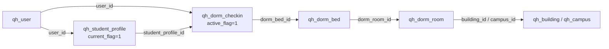

# 青禾校园智能助手：现有系统审计

## 审计范围与方法

本审计仅读取当前仓库源码与文档，不连接 MySQL/Redis、不执行 SQL、不启动服务。已完整读取用户指定的 311 个文件（220 个 Java、22 个 JS、29 个 Vue、22 个 Markdown、16 个 SQL、1 个 XML、1 个 YAML），涵盖 README、后端 API/配置、Controller、Service/Impl、Entity、DTO、VO、Interceptor、RedisKeys、SQL、前端 API/路由/页面和 docs。

结论以当前 Controller、Service/Impl、VO/DTO、SQL 和前端调用为准；历史文档仅作为交叉核对，不把模块名视为接口存在证明。

## 当前认证与权限事实

- 用户登录返回随机 Token；会话存于 Redis Hash `qh:login:token:{token}`，TTL 30 分钟。
- 管理员登录会话独立存于 `qh:admin:token:{token}`，TTL 30 分钟。
- 前端 Axios 对普通请求发送用户 `Authorization: Bearer <token>`，仅 `/admin/` 请求发送管理员 Token；401 时分别清理会话并跳转到用户或管理员登录页。
- `RefreshTokenInterceptor` 先从 Bearer Token 恢复用户上下文，`LoginInterceptor` 保护普通用户接口；`AdminAuthInterceptor` 独立保护 `/api/admin/**`。`WebConfig` 已将 `/api/admin/**` 排除在普通登录拦截之外。
- 因此用户 Token 与管理员 Token 有 Redis Key、前端存储与拦截器三层隔离。Agent 只能接收并转发当前用户 Token，不能调用任何 `/api/admin/**`。

## 已有用户端只读接口

| 能力 | 已有接口 | 登录 | 证据与限制 |
|---|---|---:|---|
| 当前用户资料 | `GET /api/user/me` | 是 | 服务端从 `UserContext` 获取当前用户；资料含当前学生档案聚合字段。 |
| 商铺搜索/详情 | `GET /api/shops`、`GET /api/shops/{id}` | 否 | 列表支持 `keyword`、`categoryId`、`sort`。 |
| 店内商品 | `GET /api/shops/{id}/goods` | 否 | 支持店铺内列表与分页。 |
| 商品浏览/详情 | `GET /api/goods`、`GET /api/goods/{id}` | 否 | 列表只支持 `shopId` 和分页，不支持关键字。 |
| 可领取券 | `GET /api/coupons` | 否（可携带用户态） | 由服务端时间、领取窗口和库存筛选；带用户 Token 时返回领取态。 |
| 我的优惠券 | `GET /api/coupons/mine` | 是 | 仅按 `UserContext` 的当前用户查询。 |
| 我的订单 | `GET /api/orders`、`GET /api/orders/{id}` | 是 | 查询条件固定附加当前 `userId`，跨用户详情返回无权访问。 |
| 学生资料/宿舍 | `GET /api/student/profile`、`GET /api/student/dorm/me` | 是 | 端点无身份参数；宿舍响应已脱敏学号和联系电话。 |
| 我的地址 | `GET /api/addresses`、`GET /api/addresses/{id}` | 是 | 仅当前用户；列表可由调用方以 `isDefault=1` 只读筛选。 |
| 附近商铺 | `GET /api/explore/shops/nearby` | 否 | `longitude`、`latitude`、`radius`、分页、分类；半径 0.1--20 km。 |
| 热门探店 | `GET /api/explore/posts?sort=hot` | 否 | Redis 热榜不可用时按 MySQL 点赞/时间回退。 |

## 优惠与商品事实

`qh_coupon` 具有金额/折扣率、门槛、库存、`status`、领取窗口、使用窗口和 `shopId`。`CouponServiceImpl.pageAvailable` 使用服务端 `now` 筛选 `ENABLED`、`receiveStartTime <= now <= receiveEndTime` 及库存，故“今天可领取优惠券”有可靠实时数据依据。

`qh_user_coupon` 通过 `(user_id, coupon_id)` 关联用户和券，并记录使用订单、领取/锁定/使用/过期状态。优惠券仅与店铺关联；下单校验店铺和门槛，未建模商品级适用范围。

`qh_goods`/`GoodsVO` 只有 `price`、`stock`、`saleStatus` 等字段；未发现原价、优惠价、活动价、促销时间或商品促销关联。因此“哪些商品正在直接降价”不可实现；“哪些商品可用某店优惠券”最多依据 `shopId` 作店铺级推断，且仍缺少商品排除规则，必须标为待补充。

## 用户、学生与宿舍关系

映射成立：学生档案以 `user_id` 关联当前用户，入住记录同时保存用户、学生档案与床位。现有 `/api/student/dorm/me` 已按当前用户给出宿舍信息，因此无需也不得让 Agent 传入 `userId`、`studentId` 或学号。

## 管理员专属数据

管理员报表、订单、优惠券管理、商铺/商品管理、学生档案、宿舍资源和入住管理均在 `/api/admin/**`，由 `AdminAuthInterceptor` 保护。普通用户 Agent 不得将这些接口视为可复用的数据来源，即使其返回字段看似有用。

## 适合作为首批 RAG 候选的现有文档

建议首批纳入经人工清洗和版本标记后的 Markdown：`README.md`、`docs/PROJECT_SPEC.md`、`backend/API.md`、`docs/api-contract.md`、`docs/page-design.md`、`docs/order-state-machine.md`、`docs/order-websocket-design.md`、`docs/order-coupon-redis-design.md`、`docs/explore-design.md`、`docs/deployment-guide.md`、`docs/acceptance-checklist.md`。`docs/database-design.md` 可作为内部策展资料，不应把其中的实时数据或连接信息写入回答。

仓库内未发现可直接作为首批知识库的业务 DOCX/PDF；后续若导入学校正式规章或指南，应先审查来源、有效期、个人信息与版权。

## 审计结论

推荐一期定位为“只读、Token 透传、Spring Boot 工具代理型校园助手”。可立即复用的高价值能力为店铺搜索、商品浏览、今日可领取券、我的券、我的订单、我的宿舍、当前资料、地址、附近商铺和热门探店。商品关键字搜索、商品直接优惠、店铺优惠汇总、默认地址专用查询和受治理的校园知识库仍需补齐。
