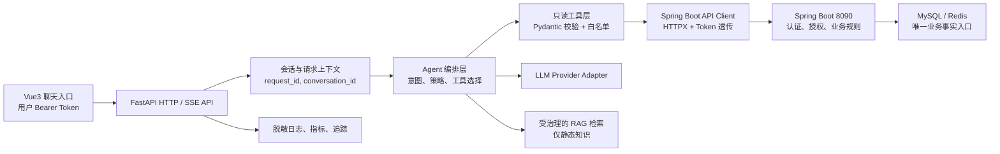

# 青禾校园智能助手：总体架构

## 推荐架构

一期采用 FastAPI + Pydantic + HTTPX 异步客户端 + LangGraph 的受限状态图。选择 LangGraph 是为了将“意图判断 → 工具白名单校验 → 最多 N 次只读工具调用 → 基于结果生成回答”显式编排；它不负责业务授权。若一期交互始终是单工具查询，可保留同一端口，用轻量状态机替换图编排，但不得将工具执行、Token 处理和模型调用堆入 `main.py`。

FastAPI 路由与 Spring Boot API 均使用异步 I/O；HTTPX `AsyncClient` 采用连接池、细分 connect/read/write/pool 超时。Pydantic 用于请求、工具参数、后端响应适配和结构化错误校验。模型供应商只能经 Provider 抽象层调用，工具层不得依赖某一家 SDK。



## 各层职责

| 层 | 职责 | 禁止事项 |
|---|---|---|
| Vue3 聊天入口 | 收集问题、生成 `conversation_id`、携带当前用户 Bearer Token、渲染流式事件 | 不解析 Token、不发送管理员 Token、不将用户 ID 放入消息。 |
| FastAPI API | `POST /v1/chat` 与可选 `GET /v1/chat/stream`；CORS、限流、请求结构校验、统一错误响应 | 不直接访问业务库/Redis。 |
| Agent 编排 | 系统提示词、意图分类、工具规划、最大调用次数、结果归并、拒答/降级 | 不把模型生成参数直接发给后端。 |
| 工具层 | 每个工具的 Pydantic 输入/输出、工具白名单、敏感级别、连续调用规则 | 不绕过 Client 或直接拼业务 SQL。 |
| Spring Boot Client | 唯一业务访问通道；转发 `Authorization`、白名单路径、超时/有限重试、结果适配 | 不把 Token 写入日志，不调用 `/api/admin/**`。 |
| 模型适配 | 统一 `chat`、tool-call、structured-output、usage/latency 接口 | 不散落供应商 SDK 调用。 |
| 会话状态 | 保存最少的对话上下文、工具摘要和到期时间；后续可使用独立存储 | 不缓存订单/券/宿舍的实时事实。 |
| 可观测性 | request_id、trace/span、工具/模型耗时、错误分类、脱敏审计 | 不记录原始 Token、完整电话、地址、学号或模型敏感上下文。 |

## 后续目录规划

```text
agent-service/
├── app/
│   ├── main.py                 # 仅创建应用、注册路由和生命周期
│   ├── api/                    # chat、health、SSE 路由及依赖注入
│   ├── core/                   # settings、错误码、策略、限流、CORS
│   ├── agent/                  # 图状态、路由、工具选择、回答合成
│   ├── tools/                  # 一个只读工具一个模块，含输入/输出模型
│   ├── clients/                # Spring Boot 与 LLM Provider Client
│   ├── schemas/                # Pydantic HTTP、工具、事件、错误模型
│   ├── prompts/                # 版本化系统提示词和工具使用规则
│   ├── memory/                 # 对话摘要、checkpointer、RAG 接口
│   └── observability/          # logging、metrics、tracing、脱敏
├── tests/                      # unit、integration、security、evals
├── docs/                       # 本阶段八份设计文档
├── pyproject.toml              # 后续锁定 Python/依赖版本
├── .env.example                # 仅变量名和示例占位符
└── README.md                   # 运行、安全与验收说明
```

## 请求、会话与流式协议

- 客户端发送 `message`、客户端生成或服务端返回的 `conversation_id`，以及 `Authorization: Bearer <user-token>`；FastAPI 生成 `request_id`。
- FastAPI 在请求上下文保存 Token 的内存短生命周期引用，只向 Spring Boot Client 的白名单请求透传原样 Header。它不解码 Token 来判定用户或管理员角色。
- Spring Boot 的 401/403 保持原语义并映射为 Agent 的 `AUTH_EXPIRED`/`ACCESS_DENIED`；前端收到 401 时复用既有用户会话清理和登录跳转。
- SSE 事件建议为 `message.started`、`tool.started`、`tool.completed`、`answer.delta`、`answer.completed`、`error`；事件只含工具名称、脱敏摘要和耗时，绝不回显 Token。

## 可靠性、降级与错误

默认总请求预算 20 秒，工具单次预算 5 秒（附近商铺可 8 秒），模型预算由 `LLM_TIMEOUT_SECONDS` 控制。仅对幂等 GET 的连接失败、超时和 502/503/504 作 1 次带抖动退避重试；4xx、业务错误、参数错误不重试。按后端基址和模型供应商分别设置熔断：连续失败时快速返回“服务暂不可用，请稍后重试或使用页面查询”。

建议错误码：`AUTH_REQUIRED`、`AUTH_EXPIRED`、`ACCESS_DENIED`、`VALIDATION_ERROR`、`TOOL_NOT_ALLOWED`、`BACKEND_TIMEOUT`、`BACKEND_UNAVAILABLE`、`MODEL_TIMEOUT`、`MODEL_UNAVAILABLE`、`KNOWLEDGE_UNAVAILABLE`、`RATE_LIMITED`、`INTERNAL_ERROR`。所有响应包含 `request_id`。

## 环境变量

| 变量 | 一期是否必需 | 用途 |
|---|---:|---|
| `LLM_PROVIDER`、`LLM_API_KEY`、`LLM_BASE_URL`、`LLM_MODEL` | 是（启用模型时） | Provider 抽象层配置；Key 只在运行环境保存。 |
| `LLM_TEMPERATURE`、`LLM_TIMEOUT_SECONDS` | 是 | 稳定回答与超时预算。 |
| `QINGHE_BACKEND_BASE_URL` | 是 | Spring Boot API 基址，例如部署环境的受控地址。 |
| `AGENT_ALLOWED_ORIGINS`、`AGENT_LOG_LEVEL` | 是 | 前端来源白名单和日志级别。 |
| `EMBEDDING_PROVIDER`、`EMBEDDING_API_KEY`、`EMBEDDING_MODEL` | 否，Phase 4 | 仅启用 RAG 后使用。 |

配置不得包含真实模型 Key、MySQL/Redis 密码或 OSS AccessKey。生产环境还应补充密钥注入、TLS、受信代理与速率限制配置。
